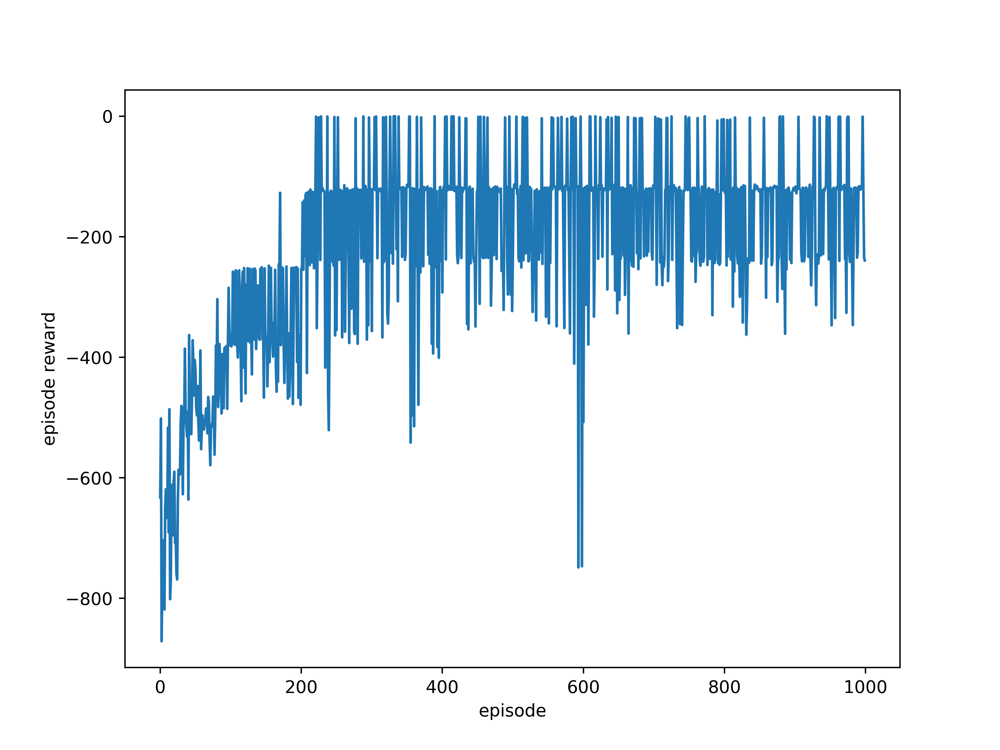
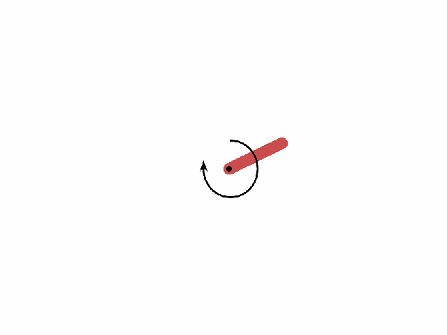

# Deep Deterministic Policy Gradient (DDPG)
A simple implementation of [DDPG](https://arxiv.org/abs/1509.02971), tested with gym environment ['Pendulum-v0'](http://gym.openai.com/envs/Pendulum-v0/).

## Environment
- `python 3.6.7`  
- `numpy 1.18.5`  
- `pytorch 1.3.1`  
- `gym 0.15.7`  
- `matplotlib 1.3.1`  
- `tqdm 4.60.0`  

## Training Stage
reward *vs*. episode  
<left class="half">
    
</left>

### Demo
