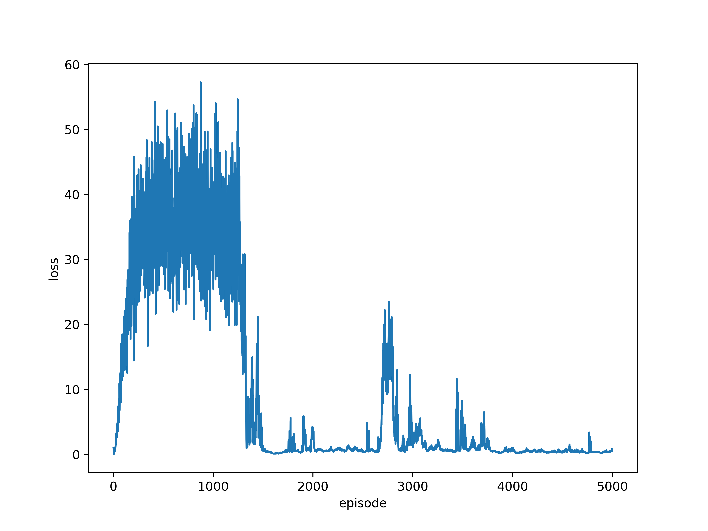
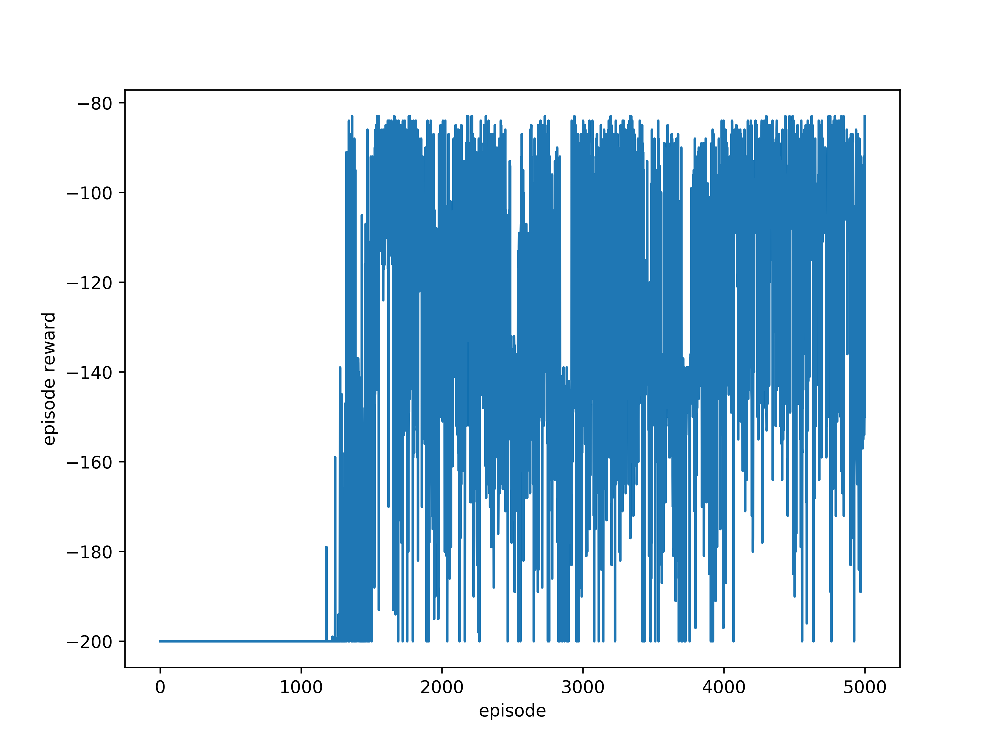
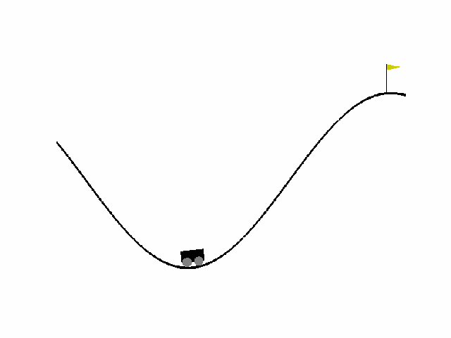

# Deep Q-Network (DQN)
A simple implementation of [DQN](https://www.datascienceassn.org/sites/default/files/Human-level%20Control%20Through%20Deep%20Reinforcement%20Learning.pdf), tested with gym environment ['MountainCar-v0'](https://gym.openai.com/envs/MountainCar-v0/).

## Environment
- `python 3.6.7`  
- `numpy 1.18.5`  
- `pytorch 1.3.1`  
- `gym 0.15.7`  
- `matplotlib 1.3.1`  
- `tqdm 4.60.0`  

## Train Stage
<center>
    
    
    loss <em>vs</em>. episode (left) and reward <em>vs</em>. episode (right)
</center>

## Test Stage
### Result
```
Episode x 100   average episode reward: -107.0500
```

### Demo
