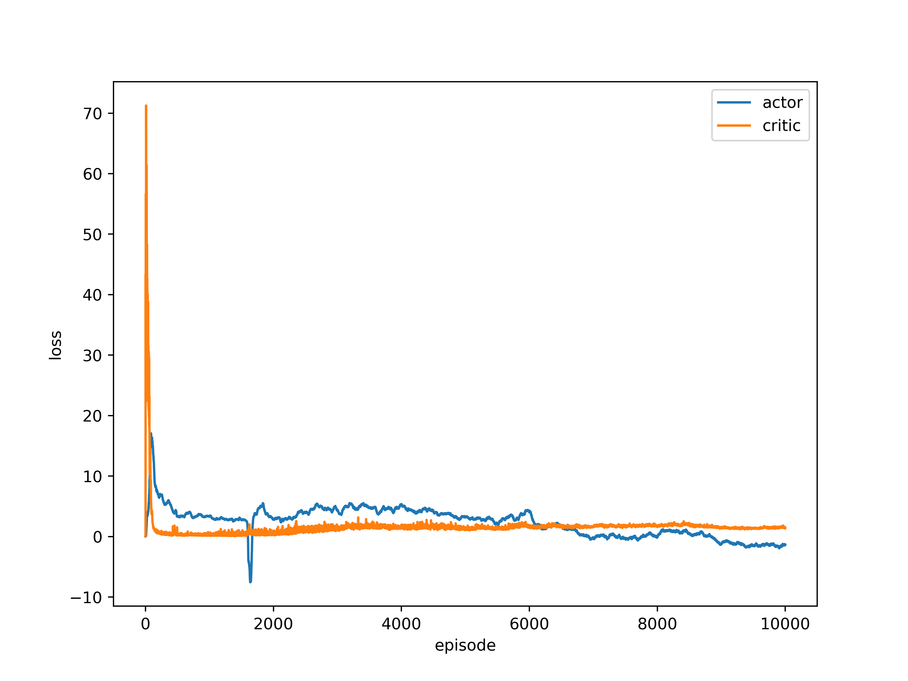
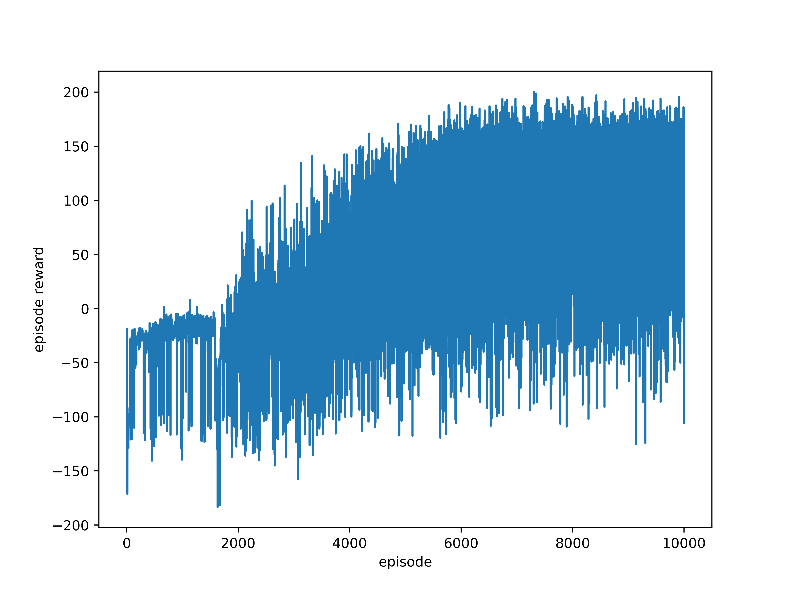

# Twin Delayed Deep Deterministic Policy Gradient (TD3)
A simple implementation of [TD3](https://arxiv.org/abs/1802.09477), tested with gym environment ['BipedalWalkerHardcore-v2'](http://gym.openai.com/envs/BipedalWalkerHardcore-v2/).

## Environment
- `python 3.6.7`  
- `numpy 1.18.5`  
- `pytorch 1.3.1`  
- `gym 0.15.7`  
- `matplotlib 1.3.1`  
- `tqdm 4.60.0`  

## Training Stage
loss *vs*. episode  
<left class="half">
    
</left>

 

reward *vs*. episode  
<left class="half">
    
</left>

## Testing Stage
